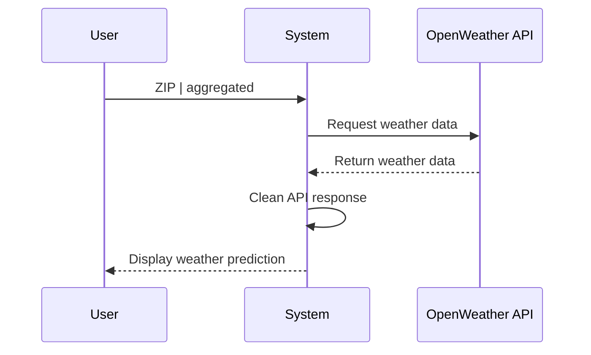

# Weather Weekend Project

This is a Python project that provides a weather forecast for the upcoming weekend based on a given ZIP code. It also includes functionality to generate a flowchart diagram representing the forecast.

## Project Structure

The project has the following structure:

    weather_weekend
    │   main.py
    │   requirements.txt
    ├── html
    │   │   mermaid.min.js
    │   │   (Empty directory where the generated diagrams will be saved)
    ├── diagram
    │   │   __init__.py
    │   │   diagram.py
    │   │   utils.py
    └── weather_api
        │   __init__.py
        │   api.py
        │   utils.py
        │   dummy.py

## Installation

1.  Clone this repository or download the ZIP file.
2.  Ensure you have Python 3.9 installed on your system.
3.  Install the required dependencies by running the following command in the project directory:

`pip install -r requirements.txt`

## Usage

To use this weather forecast tool, execute the `main.py` script with the desired command-line arguments.

`python main.py --zip ZIP_CODE --forecast [--agg] [--diag] [--with_data]`

-   `--zip`: Specify the ZIP code for which you want to get the weather forecast. This argument is required.
-   `--forecast`: Print the weather forecast for the upcoming weekend.
-   `--agg`: (Optional) If provided, the script will show an aggregated weather forecast instead of a three-hour forecast.
-   `--diag`: (Optional) Generate a flowchart diagram representing the forecast.
-   `--with_data`: (Optional) If provided, the diagram will be generated with the weather data. If not, an empty diagram will be generated.

### Examples

1.  To get the weather forecast for a specific ZIP code (e.g., 32201) for the upcoming weekend:

`python main.py --zip 32201 --forecast`

2. To get the aggregated weather forecast for a specific ZIP code (e.g., 32201) for the upcoming weekend:

`python main.py --zip 32201 --forecast --agg`

3. To generate a flowchart diagram representing the weather forecast for a specific ZIP code (e.g., 32201) for the upcoming weekend:

`python main.py --zip 32201 --forecast --diag`

4. To generate a flowchart diagram with weather data representing the forecast for a specific ZIP code (e.g., 32201) for the upcoming weekend:

`python main.py --zip 32201 --forecast --diag --with_data`

## API Key

The script requires an API key to fetch weather data from the OpenWeather API. The API key can be provided in two ways:

1.  Set the `OPENWEATHER_API_KEY` environment variable with your API key.
2.  When prompted, you can enter the API key interactively.

Note: The API key is not stored in the script or any file. It is kept in the environment variable only for the duration of the script execution.

## Note

If the weather data for the next weekend is not available (e.g., the script is run on a Monday), the tool will use stored dummy data to show the workings. This is to ensure that the flowchart diagram can be generated even when fresh weather data is not available.

## Execution diagram

This is the execution diagram for the present project.

